# Amazon Best Sellers Data Warehouse  
**Production-Style ETL Pipeline | Python, Selenium, PostgreSQL, SQL Triggers, Docker**

A production-oriented data warehouse pipeline that scrapes Amazon Best Sellers data, applies database-level business logic using PostgreSQL triggers, and stores historical product ranking and price snapshots for analytical use.

## Table of Contents
- [Why this project?](#why-this-project)
- [Executive Summary](#-executive-summary)
- [Project Overview](#-project-overview)
- [Setup & Installation](#️-setup--installation)
- [Key Design Principles](#-key-design-principles)
- [Exploratory Data Analysis](#-exploratory-data-analysis)
- [Data Warehouse Design](#️-data-warehouse-design)
- [Business Logic via PostgreSQL Triggers](#-business-logic-via-postgresql-triggers)
- [Data Pipeline Documentation](#data-pipeline-documentation)
- [Execution Flow](#execution-flow)
- [Key Business Insights](#-key-business-insights)
- [License](#-license)

---

## Why this project?
- Monitor market trends
- Analyze historical price and ranking dynamics
- Prepare high-quality datasets for analytics, BI, and forecasting


## 📝 License

This project is for educational purposes only. Ensure compliance with Amazon's Terms of Service.

All analyses, visualizations, and dashboards are created for demonstration and learning purposes within the scope of data engineering and analytics education.

---

## 🤝 Contributing & Contact

For questions, suggestions, or collaboration opportunities, feel free to open an issue or reach out.

**Project Highlights:**
- 🏗️ Production-grade ETL pipeline design
- 🗄️ Advanced PostgreSQL trigger-based business logic
- 📊 Comprehensive data analysis and visualization
- 🎯 Real-world market insights from e-commerce data

---

## 📌 Executive Summary

This project is a **production-grade data warehouse and ETL pipeline** designed to systematically collect, store, and analyze Amazon Best Sellers data over time.

The system successfully:
- Scrapes the **Top 100 best-selling products per category**
- Captures **ranking snapshots** with historical tracking
- Collects **price, ratings, and review metadata**
- Stores data using a **raw → core data warehouse architecture**
- Enforces **data consistency and idempotency via PostgreSQL triggers**
- Provides **analytical views and dashboards** for market insights

### Current Achievements

✅ **Data Engineering**: Robust ETL pipeline with anti-blocking mechanisms and graceful error handling  
✅ **Data Modeling**: Scalable warehouse design with raw/core separation and partitioned tables  
✅ **Automation**: Database-driven business logic ensuring data quality and idempotency  
✅ **Analytics**: Comprehensive exploratory analysis revealing pricing patterns, ranking dynamics, and market trends  
✅ **Visualization**: Power BI dashboards and Python-generated insights for decision-making

The project emphasizes **production-oriented data engineering principles**, ensuring analyses are based on clean, historical, and trustworthy data.

Planned future phases include:
- Real-time data quality monitoring
- Enhanced geographic and seasonal trend analysis


---

## 🚀 Project Overview

This repository contains a complete ETL pipeline for scraping Amazon Best Sellers data and storing it in a PostgreSQL data warehouse.

**Technology Stack:**
- **Backend**: Python 3.10+, Selenium WebDriver
- **Database**: PostgreSQL 14+ with advanced triggers and partitioning
- **Data Processing**: pandas, NumPy
- **Visualization**: Matplotlib, Seaborn, Power BI
- **Infrastructure**: Docker, docker-compose
- **Environment**: Conda for dependency management

The pipeline is capable of:
- Extracting Top 100 products per category
- Tracking ranking and price changes over time
- Collecting reviews and rating distributions
- Maintaining historical snapshots for longitudinal analysis
- Generating analytical views for business intelligence
- Producing data-driven insights and visualizations

---

## 🛠️ Setup & Installation

### Prerequisites
- Python 3.10+
- Docker and Docker Compose
- Conda (recommended) or pip


### Database Connection

The analysis notebook connects to PostgreSQL using:
```python
dbname = 'amazon_scraping_db'
user = 'admin'
password = 'admin123'
host = 'localhost'
port = '5432'
```

Update these credentials in `credential.env` and the notebook as needed.

---

## 🧠 Key Design Principles

- **Raw vs Core separation** for clean data modeling
- **Idempotent pipelines** (safe to re-run)
- **Database-driven business logic**
- **Historical tracking by design**
- **Anti-blocking scraping strategy**
- **Production-ready structure**

---

## 📊 Exploratory Data Analysis

A comprehensive exploratory analysis has been conducted on the collected data, revealing key insights about product performance, pricing patterns, and market dynamics across categories.

### Key Findings


#### 1. Price Patterns by Category

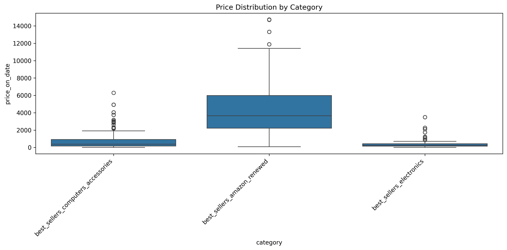

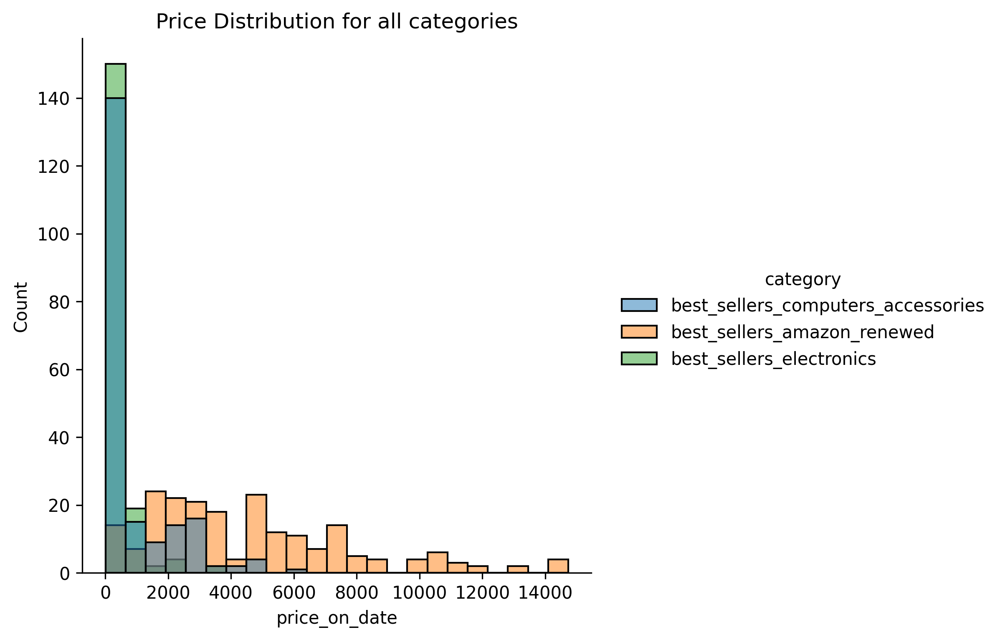


**Category-Specific Distributions:**

<table>
<tr>
<td width="50%">
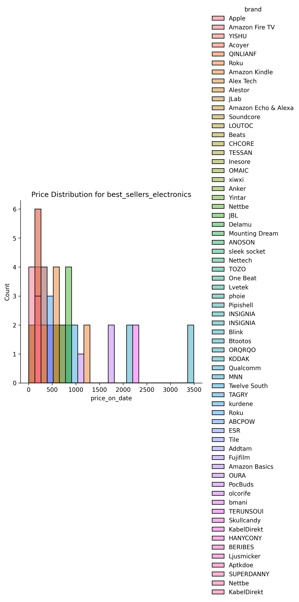
<p align="center"><b>Electronics</b><br/>Wide price range with premium segment</p>
</td>
<td width="50%">
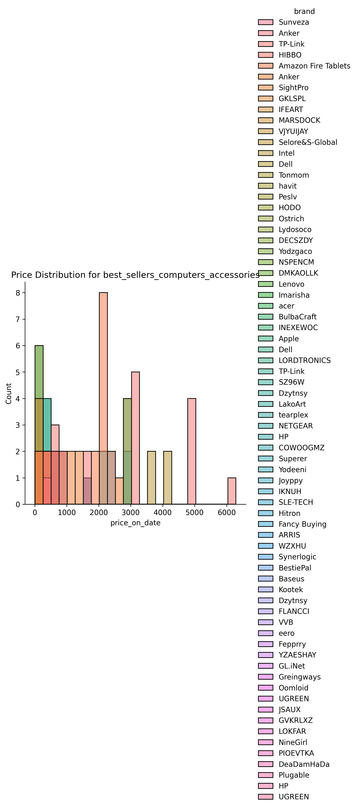
<p align="center"><b>Computers & Accessories</b><br/>Concentrated mid-range pricing</p>
</td>
</tr>
<tr>
<td width="50%">
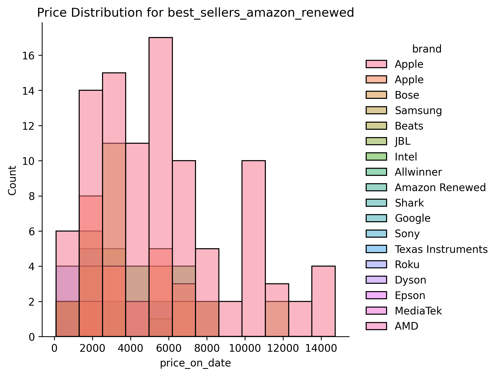
<p align="center"><b>Amazon Renewed</b><br/>Budget-friendly refurbished products</p>
</td>
<td width="50%">
</td>
</tr>
</table>

#### 3. Top 10 Ranking Analysis


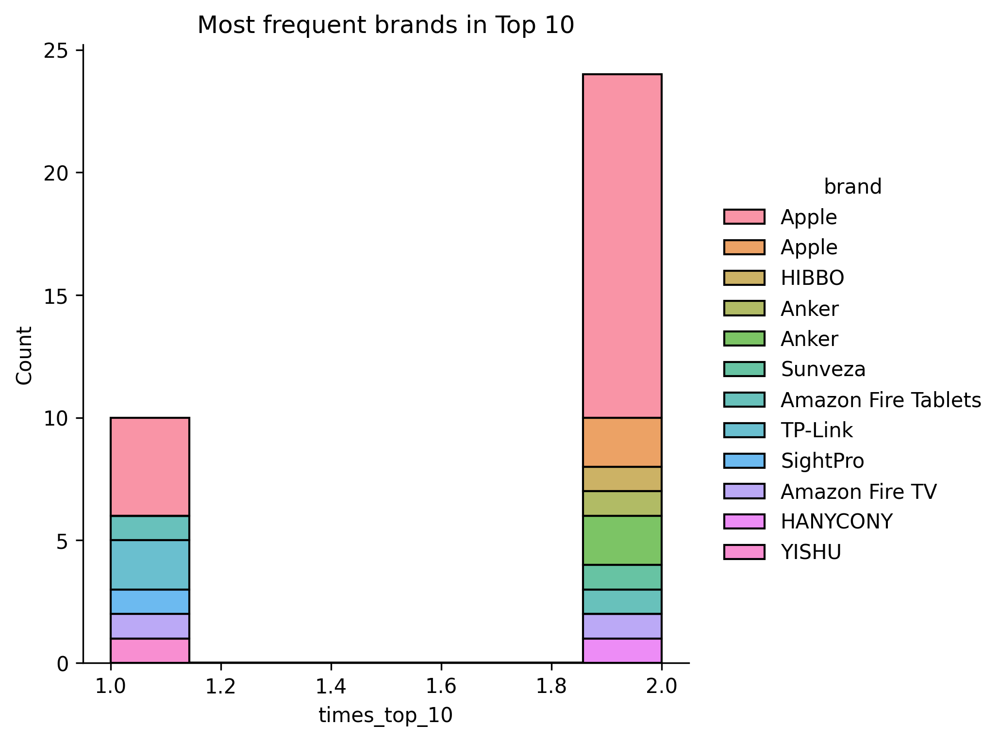

**Top-performing brands**:
- Certain brands appear repeatedly in top 10 across multiple observation periods
- Brand strength correlates with ranking stability

#### 4. Ranking Volatility

Analysis of ranking stability revealed:
- **Stable performers**: Products with low standard deviation maintain consistent positions
- **Volatile products**: High ranking fluctuation indicates seasonal demand or competitive pressure
- **Rank range**: Difference between best and worst position indicates market competitiveness

#### 5. Geographic Review Patterns


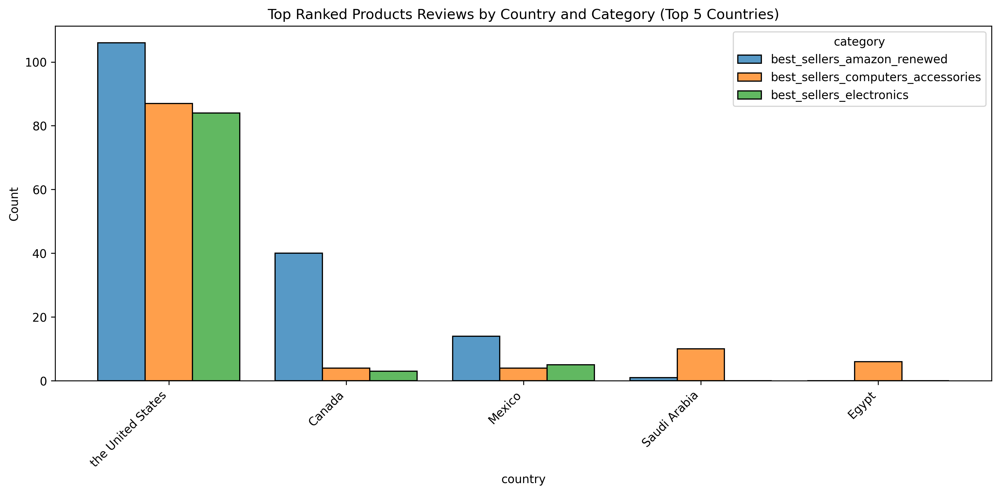

**Key insights:**
- Top 5 markets dominate review activity
- Top-ranked products show different geographic patterns than overall dataset
- Category preferences vary significantly by country

### Statistical Highlights

```
Average Metrics per Category:
- Products tracked: ~100 per category
- Average rank volatility (std): 15-25 positions
- Price range within categories: 10x-30x variation
- Review distribution: Concentrated in specific markets
```

### Analytical Views Created

The analysis utilizes several PostgreSQL analytical views:
- `analytics.category_metrics` - Aggregated metrics per category
- `analytics.latest_product_rank` - Most recent ranking snapshot
- `analytics.times_in_top` - Products that reached top 10
- `analytics.top_ranked_products_reviews` - Review analysis for top products

### Power BI Dashboards

Interactive dashboards have been developed to enable real-time exploration of the data:

<table>
<tr>
<td align="center">
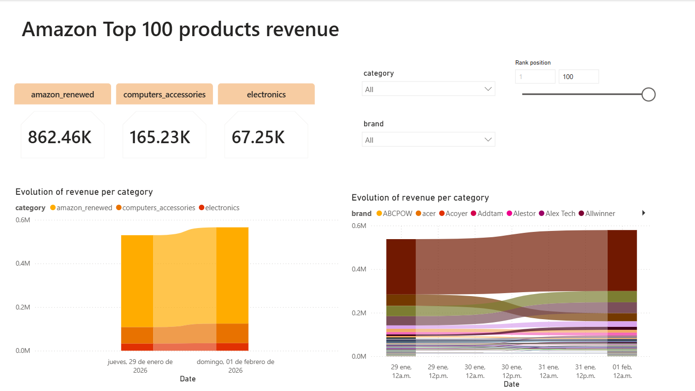
<p><b>Revenue Analysis</b><br/>Price trends and revenue insights</p>
</td>
</tr>
<tr>
<td align="center">
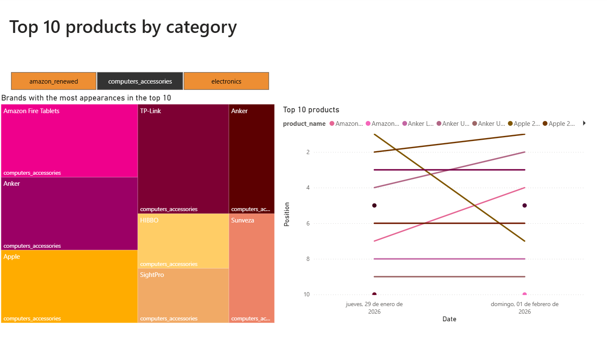
<p><b>Top Products Analysis</b><br/>Best-performing products over time</p>
</td>
</tr>
<tr>
<td align="center">
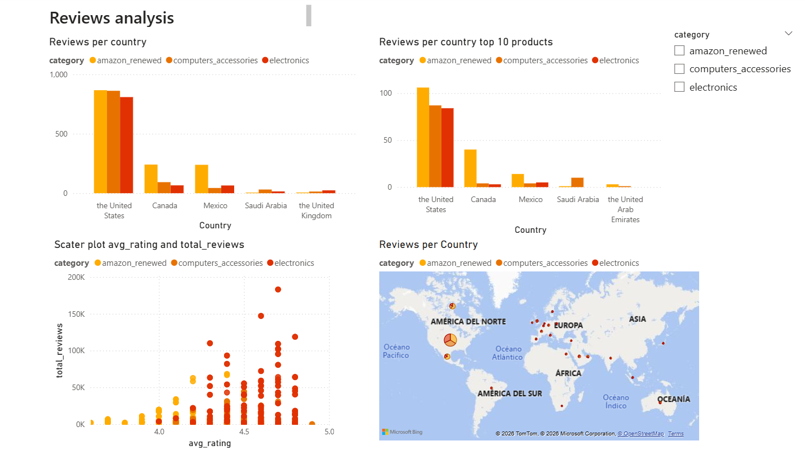
<p><b>Reviews Analysis</b><br/>Rating distributions and sentiment</p>
</td>
</tr>
</table>

**Dashboard Features:**
- Interactive filtering by category, brand, and date range
- Real-time ranking position tracking
- Price evolution visualization
- Top performers comparison

### Accessing the Full Analysis

To explore the complete exploratory analysis:

1. **Jupyter Notebook**: Open [exploratory_analisys.ipynb](analysis/exploratory_analisys.ipynb)
   - Contains all queries, visualizations, and statistical analysis
   - Fully documented with markdown explanations
   - Can be re-run with updated data

2. **Generated Visualizations**: Available in [analysis/pics/](analysis/pics/)
   - Price distributions by category
   - Top 10 product analysis
   - Geographic review patterns
   - Brand performance metrics

3. **SQL Views**: Analytical views defined in [analysis/views.sql](analysis/views.sql)
   ```sql
   -- Example: Latest rankings with price
   SELECT * FROM analytics.latest_product_rank;
   
   -- Products that reached top 10
   SELECT * FROM analytics.times_in_top;
   
   -- Category performance metrics
   SELECT * FROM analytics.category_metrics;
   ```

### Next Steps in Analysis

Based on these findings, future analyses will focus on:
- Time series analysis of price evolution and ranking changes
- Correlation between price points, reviews, and ranking success
- Predictive modeling for ranking performance
- Seasonal trend identification and forecasting
- Deep-dive category-specific market analysis

---


## 🗄️ Data Warehouse Design

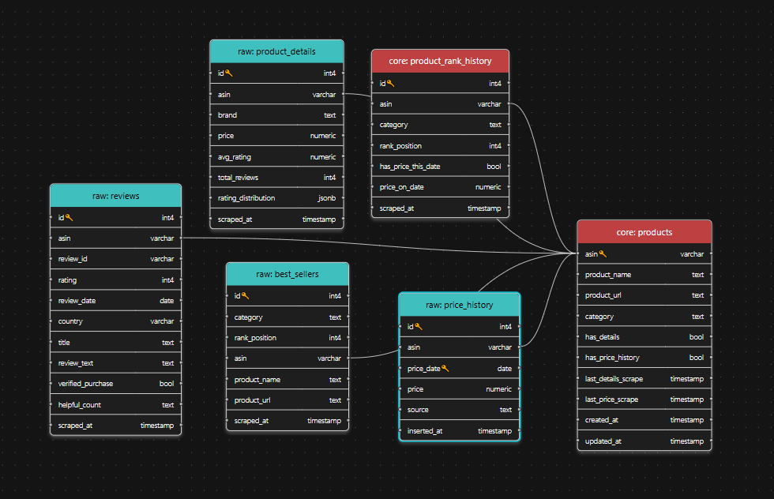

### RAW Schema (Landing Zone)

Stores unprocessed, append-only scraped data.

Tables:
- `raw.best_sellers`
- `raw.product_details`
- `raw.reviews`
- `raw.price_history` (partitioned by month)

Purpose:
- Preserve original data
- Enable reprocessing
- Prevent data loss

---

### CORE Schema (Curated Layer)

Stores cleaned, deduplicated, analytics-ready data.

Tables:
- `core.products`  
  Master product table (one row per ASIN)

- `core.product_rank_history`  
  Daily snapshots of:
  - rank position
  - category
  - price (if available)

---

## 🔁 Business Logic via PostgreSQL Triggers

Critical business rules are enforced at the database level:

- Automatic upsert of products
- One rank snapshot per product per day
- Price updates linked to ranking snapshots
- Duplicate prevention across runs

This guarantees:
- Consistent historical data
- Safe pipeline re-execution
- Simpler and more reliable ETL code

---


# Data Pipeline Documentation

## Overview

This ETL (Extract, Transform, Load) pipeline scrapes Amazon Best Sellers data and product details, storing them in a PostgreSQL database with both raw and core schemas for data processing.

---

## Architecture Flow Diagram

```
┌─────────────────────────────────────────────────────────────────────────────────┐
│                           WEEKLY ETL PIPELINE                                   │
│                        (run_weekly_etl.py)                                      │
└─────────────────────────────────────────────────────────────────────────────────┘
                                    │
                                    ▼
        ┌───────────────────────────────────────────────────────────┐
        │                    STEP 1: BEST SELLERS                   │
        │              Extract Top 100 Products                     │
        └───────────────────────────────────────────────────────────┘
                                    │
            ┌───────────────────────┴───────────────────────┐
            ▼                                               ▼
┌─────────────────────────┐                     ┌─────────────────────────┐
│   best_sells_scraping   │                     │  load_raw_top_products  │
│        (EXTRACT)        │───────────────────▶ │        (LOAD)           │
│                         │    Products[]       │                         │
│  • Selenium WebDriver   │                     │  • Insert raw.best_     │
│  • Scroll pagination    │                     │    sellers              │
│  • Parse HTML           │                     │  • Trigger updates      │
└─────────────────────────┘                     │    core.products        │
                                                └─────────────────────────┘
                                                           │
                                                           │ TRIGGER
                                                           ▼
                                               ┌─────────────────────────┐
                                               │  trg_best_sellers_to_   │
                                               │  core                   │
                                               │  • Upsert core.products │
                                               │  • Insert rank_history  │
                                               └─────────────────────────┘
                                    │
                                    ▼
        ┌───────────────────────────────────────────────────────────┐
        │                  STEP 2: PRODUCT DETAILS                  │
        │           Scrape Price, Reviews, Ratings                  │
        └───────────────────────────────────────────────────────────┘
                                    │
            ┌───────────────────────┴───────────────────────┐
            ▼                                               ▼
┌─────────────────────────┐                    ┌─────────────────────────┐
│     page_scraping       │                    │  load_products_details  │
│       (EXTRACT)         │───────────────────▶│        (LOAD)           │
│                         │  ProductDetails    │                         │
│  • Price extraction     │                    │  • raw.product_details  │
│  • Rating & reviews     │                    │  • raw.price_history    │
│  • Star histogram       │                    │  • raw.reviews          │
└─────────────────────────┘                    │  • Update core.products │
                                               └─────────────────────────┘
                                                           │
                                                           │ TRIGGER
                                                           ▼
                                               ┌─────────────────────────┐
                                               │  trg_product_details_   │
                                               │  update_price           │
                                               │  • Update rank_history  │
                                               │    with price_on_date   │
                                               └─────────────────────────┘
```

---

## Database Schema Flow

```
┌─────────────────────────────────────────────────────────────────────────────────┐
│                              RAW SCHEMA (Landing Zone)                          │
│                        Stores unprocessed scraped data                          │
├─────────────────────────────────────────────────────────────────────────────────┤
│                                                                                 │
│  ┌─────────────────────┐    ┌─────────────────────┐    ┌─────────────────────┐  │
│  │  raw.best_sellers   │    │ raw.product_details │    │    raw.reviews      │  │
│  ├─────────────────────┤    ├─────────────────────┤    ├─────────────────────┤  │
│  │ • asin              │    │ • asin              │    │ • asin              │  │
│  │ • category          │    │ • brand             │    │ • review_id         │  │
│  │ • rank_position     │    │ • price             │    │ • rating (1-5)      │  │
│  │ • product_name      │    │ • avg_rating        │    │ • review_text       │  │
│  │ • product_url       │    │ • total_reviews     │    │ • verified_purchase │  │
│  │ • scraped_at        │    │ • rating_distrib    │    │ • review_date       │  │
│  └──────────┬──────────┘    └──────────┬──────────┘    └─────────────────────┘  │
│             │                          │                                        │
│             │ TRIGGER                  │ TRIGGER                                │
│             ▼                          ▼                                        │
│  ┌─────────────────────────────────────────────────────────────────────────┐    │
│  │                     raw.price_history (Partitioned by Month)            │    │
│  │         Stores daily price snapshots for historical analysis            │    │
│  └─────────────────────────────────────────────────────────────────────────┘    │
└─────────────────────────────────────────────────────────────────────────────────┘
                                        │
                                        │ Triggers
                                        ▼
┌─────────────────────────────────────────────────────────────────────────────────┐
│                            CORE SCHEMA (Curated Data)                           │
│                      Cleaned, deduplicated, enriched data                       │
├─────────────────────────────────────────────────────────────────────────────────┤
│                                                                                 │
│  ┌──────────────────────────────┐       ┌──────────────────────────────────┐    │
│  │       core.products          │       │   core.product_rank_history      │    │
│  ├──────────────────────────────┤       ├──────────────────────────────────┤    │
│  │ • asin (PK)                  │◄──────│ • asin (FK)                      │    │
│  │ • product_name               │       │ • category                       │    │
│  │ • product_url                │       │ • rank_position                  │    │
│  │ • category                   │       │ • has_price_this_date            │    │
│  │ • has_details                │       │ • price_on_date                  │    │
│  │ • has_price_history          │       │ • scraped_at                     │    │
│  │ • last_details_scrape        │       └──────────────────────────────────┘    │
│  │ • last_price_scrape          │                                               │
│  └──────────────────────────────┘                                               │
└─────────────────────────────────────────────────────────────────────────────────┘
```

---

## Pipeline Conditions & Business Rules

### 1. Best Sellers Scraping Conditions

```
┌─────────────────────────────────────────────────────────────────┐
│              BEST SELLERS SCRAPING CONDITIONS                   │
└─────────────────────────────────────────────────────────────────┘
                              │
                              ▼
              ┌───────────────────────────────┐
              │   Is category valid?          │
              └───────────────────────────────┘
                     │              │
                    YES             NO ──────▶ ❌ Raise ValueError
                     │
                     ▼
              ┌───────────────────────────────┐
              │   Scrape all 2 pages          │
              │   (50 products per page)      │
              └───────────────────────────────┘
                     │
                     ▼
              ┌───────────────────────────────┐
              │   For each product:           │
              │   • Extract ASIN              │
              │   • Extract name              │
              │   • Extract URL               │
              │   • Extract rank (1-100)      │
              └───────────────────────────────┘
                     │
                     ▼
              ┌───────────────────────────────┐
              │   Insert into raw.best_sellers│
              │   ───────────────────────     │
              │   TRIGGER FIRES:              │
              │   • Upsert core.products      │
              │   • Check if new product      │
              │   • Check if new day          │
              │   • Insert rank_history       │
              └───────────────────────────────┘
```

### 2. Rank History Insert Conditions (Trigger Logic)

```
┌─────────────────────────────────────────────────────────────────┐
│        TRIGGER: fn_upsert_product_and_rank()                    │
│        Fires on: INSERT INTO raw.best_sellers                   │
└─────────────────────────────────────────────────────────────────┘
                              │
                              ▼
              ┌───────────────────────────────┐
              │   Is product NEW?             │
              │   (not in core.products)      │
              └───────────────────────────────┘
                     │              │
                    YES            NO
                     │              │
                     ▼              ▼
         ┌─────────────────┐  ┌─────────────────────────────┐
         │ INSERT rank     │  │ Check last rank_history date│
         │ history record  │  └─────────────────────────────┘
         └─────────────────┘            │
                                        ▼
                          ┌───────────────────────────────┐
                          │ Last rank date = TODAY?       │
                          └───────────────────────────────┘
                                │              │
                               YES            NO
                                │              │
                                ▼              ▼
                    ┌───────────────┐   ┌─────────────────┐
                    │   SKIP        │   │ INSERT rank     │
                    │   (already    │   │ history record  │
                    │   recorded)   │   │ for today       │
                    └───────────────┘   └─────────────────┘
```

### 3. Product Details Scraping Conditions

```
┌─────────────────────────────────────────────────────────────────┐
│              PRODUCT DETAILS SCRAPING CONDITIONS                │
└─────────────────────────────────────────────────────────────────┘
                              │
                              ▼
              ┌───────────────────────────────┐
              │   Get products needing details│
              │   ORDER BY priority:          │
              │   1. has_details = FALSE      │
              │   2. last_details_scrape NULL │
              │   3. Older than threshold days│
              └───────────────────────────────┘
                              │
                              ▼
              ┌───────────────────────────────┐
              │   For each product ASIN:      │
              └───────────────────────────────┘
                              │
                              ▼
              ┌───────────────────────────────┐
              │   Was updated TODAY?          │
              │   (last_details_scrape::DATE  │
              │    = CURRENT_DATE)            │
              └───────────────────────────────┘
                     │              │
                    YES            NO
                     │              │
                     ▼              ▼
         ┌─────────────────┐   ┌─────────────────┐
         │   SKIP          │   │   SCRAPE        │
         │   (already      │   │   product page  │
         │   done today)   │   └─────────────────┘
         └─────────────────┘            │
                                        ▼
                          ┌───────────────────────────────┐
                          │   Validate scraped data       │
                          │   (has price OR rating?)      │
                          └───────────────────────────────┘
                                │              │
                              VALID         INVALID
                                │              │
                                ▼              ▼
                    ┌───────────────┐   ┌─────────────────┐
                    │  Save to DB:  │   │  Mark as        │
                    │  • details    │   │  server_error   │
                    │  • price_hist │   │  or no_data     │
                    │  • reviews    │   └─────────────────┘
                    └───────────────┘
```

### 4. Price Update Flow (via Trigger)

```
┌─────────────────────────────────────────────────────────────────┐
│        TRIGGER: fn_update_rank_history_price()                  │
│        Fires on: INSERT INTO raw.product_details                │
│        Condition: NEW.price IS NOT NULL                         │
└─────────────────────────────────────────────────────────────────┘
                              │
                              ▼
              ┌───────────────────────────────┐
              │   Find matching rank_history  │
              │   WHERE:                      │
              │   • asin = NEW.asin           │
              │   • scraped_at::DATE =        │
              │     NEW.scraped_at::DATE      │
              │   • has_price_this_date=FALSE │
              └───────────────────────────────┘
                              │
                              ▼
              ┌───────────────────────────────┐
              │   UPDATE rank_history:        │
              │   • has_price_this_date=TRUE  │
              │   • price_on_date = NEW.price │
              └───────────────────────────────┘
```

---

## Delay Configuration (Anti-Blocking)

The pipeline implements intelligent delays to avoid server blocks:

| Scenario               | Min Delay | Max Delay | Purpose                 |
|------------------------|-----------|-----------|-------------------------|
| Success                | 3.0s      | 8.0s      | Normal between requests |
| Skip (already updated) | 0.5s      | 1.5s      | Quick skip, minimal wait|
| Server Error (blocked) | 30.0s     | 60.0s     | Long backoff to recover |
| Network Error          | 10.0s     | 20.0s     | Medium wait for network |
| Other Errors           | 5.0s      | 10.0s     | General error recovery  |
---

## Scrape Result Status Types

```
┌─────────────────────────────────────────────────────────────────┐
│                    SCRAPE STATUS TYPES                          │
├─────────────────────────────────────────────────────────────────┤
│                                                                 │
│  ✅ SUCCESS        Data scraped and saved successfully          │
│                                                                 │
│  ⏭️  SKIPPED        Product already updated today               │
│                                                                 │
│  📭 NO_DATA        Scraping returned no valid data              │
│                                                                 │
│  🚫 SERVER_ERROR   Server denied or blocked request             │
│                                                                 │
│  🌐 NETWORK_ERROR  Connection or timeout issues                 │
│                                                                 │
│  ⚠️  PARSE_ERROR    Could not parse page HTML                   │
│                                                                 │
│  ⛔ INTERRUPTED    User pressed Ctrl+C                          │
│                                                                 │
│  ❓ UNKNOWN_ERROR  Other unexpected errors                       │
│                                                                 │
└─────────────────────────────────────────────────────────────────┘
```

---


## Data Flow Summary

```
                     AMAZON WEBSITE
                           │
                           │ Selenium WebDriver
                           ▼
┌──────────────────────────────────────────────────────────┐
│                     EXTRACT LAYER                        │
│  ┌─────────────────────┐    ┌─────────────────────┐      │
│  │ best_sells_scraping │    │   page_scraping     │      │
│  │ (Top 100 products)  │    │ (Details & Reviews) │      │
│  └─────────────────────┘    └─────────────────────┘      │
└──────────────────────────────────────────────────────────┘
                           │
                           │ Python Objects
                           ▼
┌──────────────────────────────────────────────────────────┐
│                      LOAD LAYER                          │
│  ┌─────────────────────┐    ┌─────────────────────┐      │
│  │load_raw_top_products│    │load_products_details│      │
│  └─────────────────────┘    └─────────────────────┘      │
└──────────────────────────────────────────────────────────┘
                           │
                           │ SQL INSERT
                           ▼
┌──────────────────────────────────────────────────────────┐
│                    RAW SCHEMA                            │
│  • raw.best_sellers                                      │
│  • raw.product_details                                   │
│  • raw.reviews                                           │
│  • raw.price_history (partitioned)                       │
└──────────────────────────────────────────────────────────┘
                           │
                           │ Triggers
                           ▼
┌──────────────────────────────────────────────────────────┐
│                    CORE SCHEMA                           │
│  • core.products (master product list)                   │
│  • core.product_rank_history (daily rankings with price) │
└──────────────────────────────────────────────────────────┘
```
